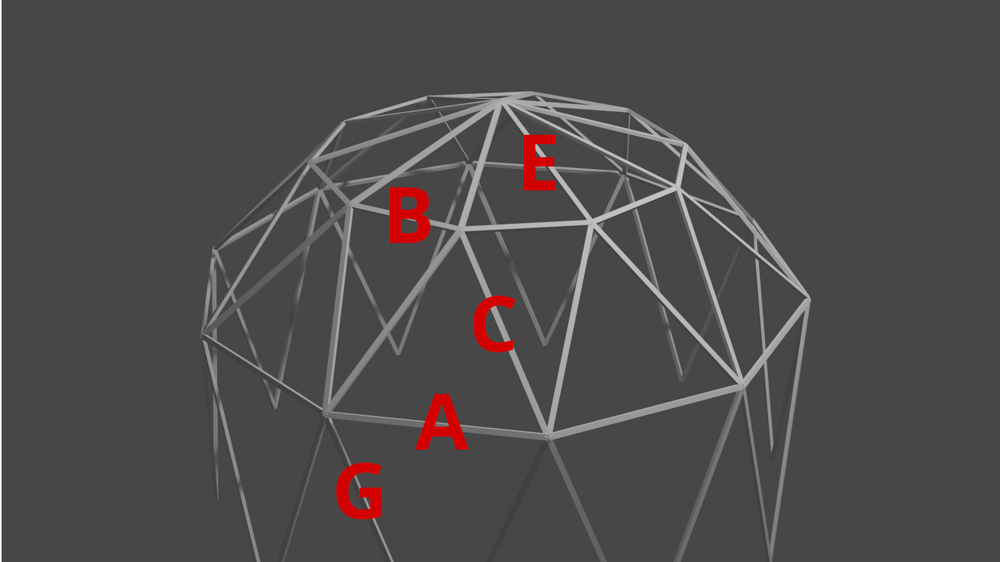

Aufbauanleitung
===============

#. großen Ring aus A-Latten bauen
#. Dreiecke an großen Ring aus C-Latten bauen, kleinen Ring aus B-Latten vervollständigen
#. E-Latten zwischen kleinem Ring und Top-Verbinder bauen (schmales Lochband nach oben)
#. Top-Plane draufziehen (bei Wind ggf. provisorisch sichern)
#. Top-Abdeckung mit Besenstiel verbinden, Plane draufziehen, in Top-Verbinder einsetzen
#. Lochband an G-Latten öffnen und an äußeren Verbindern bereitlegen
#. Konstruktion auf Schulterhöhe heben (min. 5+1 Personen)
#. G-Latten anbringen
#. Kabelbinder an Füßen vorbereiten, unten unter G-Latten schieben und Kabelbinder festziehen
#. Füße mit Tellerkopfschrauben sichern
#. Mantelplane mit Paracord an A-Latten abspannen
#. Top-Plane mit Paracord abspannen
